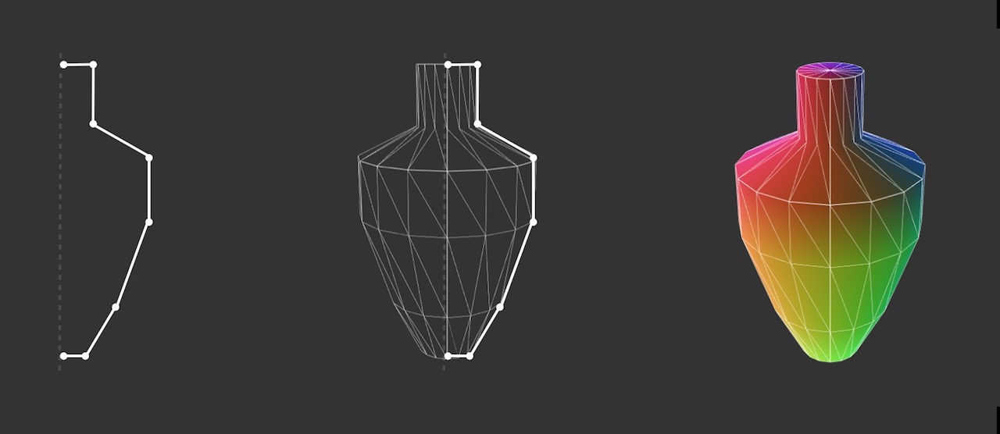

# geom-revolve



Create geometry by revolving path around Y axis

## Usage

```bash
npm install geom-resolve --save
```

#### `geometry = revolve(path, [numSteps, rotation])`

Parameters:  
`path` - list of [x, y, z] defining the path to revolve  
`numSteps` - integer, defaults to 16  
`rotation` - angle to rotate by, defaults 2 PI  

## Example

```javascript
var revolve = require('geom-revolve')

const path = [
  [0.0, 0.0, 0.0], [0.1, 0.0, 0.0], [0.2, 0.2, 0.0],
  [0.3, 0.5, 0.0], [0.3, 0.7, 0.0], [0.1, 0.8, 0.0],
  [0.1, 1.0, 0.0], [0.0, 1.0, 0.0]
]

const geometry = revolve(path, 16)
```

`geometry` will have the following structure:

```
{
  positions: [ [x, y, z], [x, y, z], ... ],
  cells: [ [a, b, c], [a, b, c], ... ],
}
```

## Demo

Download or clone this repo and run:

```
cd example
npm install
npm start
```

## License

MIT, see [LICENSE.md](http://github.com/vorg/geom-revolve/blob/master/LICENSE.md) for details.
